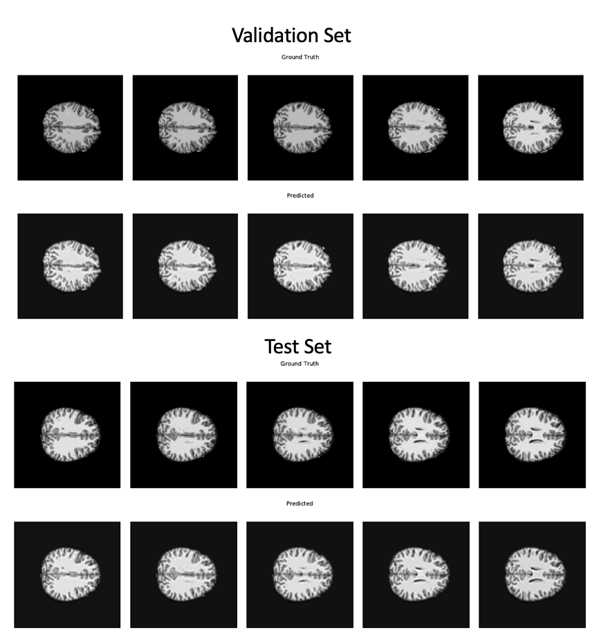

# MRI_Deep_Learning

### CNN Autoencdoer 
* Learn lower dimensional representation of 2D brain slice
* Autoencoder is able to reconstruct the input images 
* Encoding is successful and can be used as a feature extractor for a classification agent

